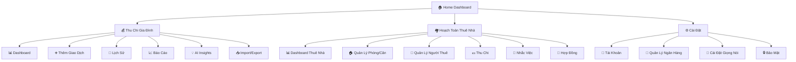
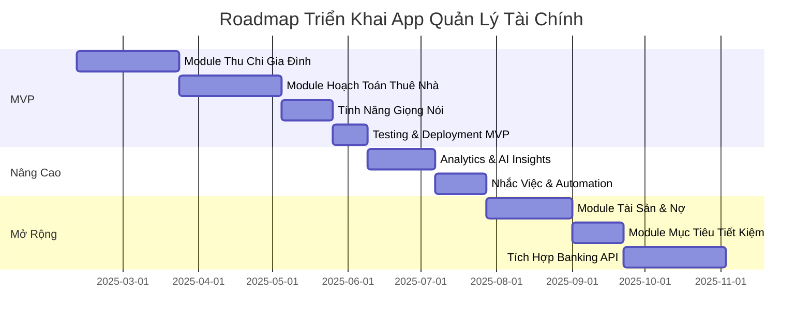

# KẾ HOẠCH TRIỂN KHAI: Ứng Dụng Quản Lý Tài Chính Gia Đình & Thuê Nhà

## A. TÓM TẮT MỤC TIÊU & NGƯỜI DÙNG

### Mục Tiêu Ứng Dụng
Xây dựng **ứng dụng mobile-first & web** giúp người dùng quản lý toàn diện tài chính cá nhân và dòng tiền từ việc cho thuê nhà, với khả năng:
- Theo dõi thu chi hàng ngày một cách dễ dàng, nhanh chóng
- Quản lý nhiều nguồn tiền (tài khoản ngân hàng, ví điện tử, tiền mặt)
- Phân loại chi tiêu theo nhiều tag để phân tích chi tiết
- Quản lý nghiệp vụ cho thuê nhà (người thuê, phòng, hợp đồng, thu chi)
- Nhập liệu bằng giọng nói để tăng tốc độ ghi chép
- Import/Export Excel để tương thích với quy trình hiện tại

### Nhóm Người Dùng Chính

| Nhóm | Đặc Điểm | Nhu Cầu Chính |
|------|----------|---------------|
| **Gia đình trẻ (25-40 tuổi)** | Có thu nhập ổn định, quản lý tài chính chủ động | Theo dõi chi tiêu, lập kế hoạch ngân sách, tiết kiệm |
| **Chủ nhà cho thuê** | Có 1-nhiều căn cho thuê, cần quản lý dòng tiền | Quản lý người thuê, thu tiền định kỳ, nhắc nhở, báo cáo |
| **Người lớn tuổi (50+)** | Ít quen công nghệ, cần UI đơn giản | Nhập liệu dễ dàng (giọng nói), hiển thị rõ ràng |
| **Freelancer/Self-employed** | Thu nhập không đều, nhiều nguồn | Theo dõi nhiều dòng tiền, phân tích thu chi theo project |

---

## B. KIẾN TRÚC MODULE TRONG 1 APP

### Navigation Structure



### Phân Quyền (Optional - cho phiên bản nâng cao)

| Role | Quyền Hạn | Use Case |
|------|-----------|----------|
| **Owner (Admin)** | Full access, quản lý tất cả module | Chủ hộ gia đình, người sở hữu nhà cho thuê |
| **Member (View/Edit)** | Xem và nhập liệu, không xóa | Vợ/chồng, con cái lớn |
| **Viewer** | Chỉ xem báo cáo, không sửa | Người thân muốn theo dõi |

> [!NOTE]
> **MVP sẽ không có phân quyền phức tạp**, chỉ 1 user/device. Phân quyền sẽ được thêm ở Phase nâng cao khi cần chia sẻ dữ liệu đa người dùng.

---

## C. DATA MODEL - ĐỀ XUẤT CẤU TRÚC EXCEL

Dựa trên phân tích file Excel hiện tại, đây là cấu trúc chuẩn hóa đề xuất:

### 1. Module Thu Chi Gia Đình

#### Sheet 1: `Transactions` (Giao Dịch)

| Cột | Kiểu Dữ Liệu | Bắt Buộc | Quy Tắc Validate | Ví Dụ |
|-----|--------------|----------|------------------|-------|
| `ID` | Text | ✅ | Unique, auto-generated | `TX2025010001` |
| `Date` | Date | ✅ | Format: DD/MM/YYYY | `15/07/2025` |
| `Type` | Text | ✅ | Enum: `Thu` hoặc `Chi` | `Chi` |
| `Category` | Text | ✅ | Từ danh sách Categories | `Nhà Hàng` |
| `Subcategory` | Text | ❌ | Từ danh sách Subcategories | `Ăn Trưa` |
| `Amount` | Number | ✅ | > 0 | `250000` |
| `Account` | Text | ✅ | Từ danh sách Accounts | `Vietcombank` |
| `Description` | Text | ❌ | Max 200 ký tự | `Ăn trưa với khách hàng` |
| `Payment_Method` | Text | ❌ | Enum: `Cash`, `Card`, `Transfer`, `E-wallet` | `Card` |
| `Reference_ID` | Text | ❌ | Mã tham chiếu bank | `VCB20250715123` |
| `Created_At` | Datetime | ✅ | Auto-generated | `15/07/2025 14:30` |
| `Updated_At` | Datetime | ✅ | Auto-updated | `15/07/2025 14:30` |

**Quy tắc validate:**
- `Date` không được là ngày tương lai (trừ khi là planned transaction)
- `Amount` phải là số dương
- `Type` + `Category` phải khớp (ví dụ: không được có `Type = Thu` nhưng `Category = Nhà Hàng`)

---

#### Sheet 2: `Categories` (Danh Mục)

| Cột | Kiểu Dữ Liệu | Bắt Buộc | Ví Dụ |
|-----|--------------|----------|-------|
| `ID` | Text | ✅ | `CAT001` |
| `Name` | Text | ✅ | `Nhà Hàng` |
| `Type` | Text | ✅ | `Chi` |
| `Icon` | Text | ❌ | `🍴` |
| `Color` | Text | ❌ | `#FF5733` |
| `Is_Active` | Boolean | ✅ | `TRUE` |

**Danh sách Categories mặc định:**

**CHI (Expenses):**
- 🎓 Education (Học tập)
- 🍴 Food & Dining (Nhà hàng, Cafe)
- 🏠 Housing (Nhà ở, Điện nước)
- 🚗 Transportation (Xe cộ, Xăng)
- 🏥 Healthcare (Y tế, Khám bệnh)
- 🛍️ Shopping (Mua sắm)
- 🎭 Entertainment (Giải trí)
- 👔 Personal Care (Chăm sóc cá nhân)
- 🎁 Gifts & Donations (Quà tặng, Từ thiện, Đám cưới/hiếu)
- 💰 Savings & Investment (Tiết kiệm, Đầu tư)
- 📱 Bills & Utilities (Hóa đơn, Internet, Điện thoại)
- 🔧 Maintenance & Repairs (Sửa chữa)
- 📊 Other Expenses (Chi phí khác)

**THU (Income):**
- 💼 Salary (Lương chính)
- 🏢 Bonus (Thưởng)
- 🏠 Rental Income (Tiền thuê nhà)
- 💹 Investment Returns (Lãi đầu tư)
- 🎁 Gifts Received (Quà tặng nhận được)
- 👴 Pension (Lương hưu)
- 💻 Freelance (Làm thêm, Freelance)
- 💵 Other Income (Thu nhập khác)

---

#### Sheet 3: `Accounts` (Tài Khoản)

| Cột | Kiểu Dữ Liệu | Bắt Buộc | Ví Dụ |
|-----|--------------|----------|-------|
| `ID` | Text | ✅ | `ACC001` |
| `Name` | Text | ✅ | `Vietcombank - Lương` |
| `Type` | Text | ✅ | `Bank`, `E-wallet`, `Cash`, `Savings` |
| `Bank_Name` | Text | ❌ | `Vietcombank` |
| `Account_Number` | Text | ❌ | `**** 1234` (masked) |
| `Initial_Balance` | Number | ✅ | `5000000` |
| `Current_Balance` | Number | ✅ | `7500000` (auto-calculated) |
| `Currency` | Text | ✅ | `VND` |
| `Is_Active` | Boolean | ✅ | `TRUE` |

**Tài khoản mặc định:**
- 💳 Vietcombank
- 💳 VPBank
- 💳 BIDV
- 📱 Momo
- 📱 Moca (Grab)
- 📱 ZaloPay
- 💵 Cash (Tiền mặt)
- 🏦 Savings (Tiết kiệm)

---

#### Sheet 4: `Monthly_Summary` (Tổng Kết Tháng)

| Cột | Kiểu Dữ Liệu | Ví Dụ |
|-----|--------------|-------|
| `Month` | Text | `2025-07` |
| `Total_Income` | Number | `29625000` |
| `Total_Expense` | Number | `18300000` |
| `Net_Savings` | Number | `11325000` |
| `Savings_Rate` | Percentage | `38.2%` |
| `Top_Category_Expense` | Text | `Nhà Hàng` |
| `Top_Category_Amount` | Number | `4500000` |

> [!IMPORTANT]
> Sheet này được **auto-calculate** từ sheet `Transactions`, không nhập tay.

---

### 2. Module Hoạch Toán Thuê Nhà

#### Sheet 1: `Properties` (Phòng/Căn)

| Cột | Kiểu Dữ Liệu | Bắt Buộc | Quy Tắc Validate | Ví Dụ |
|-----|--------------|----------|------------------|-------|
| `ID` | Text | ✅ | Unique | `PROP001` |
| `Name` | Text | ✅ | Max 100 ký tự | `Phòng 101 - Tầng 1` |
| `Address` | Text | ✅ | | `123 Nguyễn Văn A, Q1, TPHCM` |
| `Type` | Text | ✅ | Enum: `Phòng trọ`, `Căn hộ`, `Nhà nguyên căn` | `Phòng trọ` |
| `Area` | Number | ❌ | > 0, đơn vị m² | `25` |
| `Monthly_Rent` | Number | ✅ | > 0 | `3500000` |
| `Deposit` | Number | ✅ | >= 0 | `3500000` |
| `Electric_Method` | Text | ✅ | Enum: `Định mức`, `Theo số` | `Theo số` |
| `Water_Method` | Text | ✅ | Enum: `Định mức`, `Theo số` | `Định mức` |
| `Status` | Text | ✅ | Enum: `Available`, `Rented`, `Maintenance` | `Rented` |
| `Created_At` | Datetime | ✅ | | `01/01/2025 10:00` |

---

#### Sheet 2: `Tenants` (Người Thuê)

| Cột | Kiểu Dữ Liệu | Bắt Buộc | Quy Tắc Validate | Ví Dụ |
|-----|--------------|----------|------------------|-------|
| `ID` | Text | ✅ | Unique | `TEN001` |
| `Full_Name` | Text | ✅ | | `Nguyễn Văn A` |
| `Phone` | Text | ✅ | Format: 10-11 số | `0912345678` |
| `ID_Number` | Text | ✅ | Format: 9 hoặc 12 số | `001234567890` |
| `Email` | Text | ❌ | Valid email | `nguyenvana@gmail.com` |
| `Emergency_Contact` | Text | ❌ | | `0987654321` |
| `Current_Property_ID` | Text | ❌ | Link to Properties.ID | `PROP001` |
| `Move_In_Date` | Date | ❌ | | `01/07/2025` |
| `Contract_End_Date` | Date | ❌ | | `01/07/2026` |
| `Status` | Text | ✅ | Enum: `Active`, `Inactive` | `Active` |

---

#### Sheet 3: `Rental_Contracts` (Hợp Đồng Thuê)

| Cột | Kiểu Dữ Liệu | Bắt Buộc | Quy Tắc Validate | Ví Dụ |
|-----|--------------|----------|------------------|-------|
| `ID` | Text | ✅ | Unique | `CONTRACT001` |
| `Property_ID` | Text | ✅ | Link to Properties.ID | `PROP001` |
| `Tenant_ID` | Text | ✅ | Link to Tenants.ID | `TEN001` |
| `Start_Date` | Date | ✅ | | `01/07/2025` |
| `End_Date` | Date | ✅ | Must be after Start_Date | `01/07/2026` |
| `Monthly_Rent` | Number | ✅ | > 0 | `3500000` |
| `Deposit_Amount` | Number | ✅ | >= 0 | `3500000` |
| `Deposit_Paid` | Boolean | ✅ | | `TRUE` |
| `Payment_Day` | Number | ✅ | 1-31 | `5` (ngày 5 hàng tháng) |
| `Auto_Renew` | Boolean | ✅ | | `FALSE` |
| `Status` | Text | ✅ | Enum: `Active`, `Expired`, `Terminated` | `Active` |
| `Notes` | Text | ❌ | | `Hợp đồng 12 tháng` |

---

#### Sheet 4: `Rental_Transactions` (Thu Chi Thuê Nhà)

| Cột | Kiểu Dữ Liệu | Bắt Buộc | Quy Tắc Validate | Ví Dụ |
|-----|--------------|----------|------------------|-------|
| `ID` | Text | ✅ | Unique | `RENTX001` |
| `Contract_ID` | Text | ✅ | Link to Rental_Contracts.ID | `CONTRACT001` |
| `Property_ID` | Text | ✅ | Link to Properties.ID | `PROP001` |
| `Date` | Date | ✅ | | `05/07/2025` |
| `Type` | Text | ✅ | Enum: `Thu`, `Chi` | `Thu` |
| `Category` | Text | ✅ | Enum: `Tiền thuê`, `Điện`, `Nước`, `Internet`, `Sửa chữa`, `Hoàn cọc`, `Phí khác` | `Tiền thuê` |
| `Amount` | Number | ✅ | > 0 | `3500000` |
| `Account` | Text | ✅ | Từ danh sách Accounts | `Vietcombank` |
| `Payment_Method` | Text | ❌ | | `Chuyển khoản` |
| `Description` | Text | ❌ | | `Tiền thuê tháng 7/2025` |
| `Status` | Text | ✅ | Enum: `Paid`, `Pending`, `Overdue` | `Paid` |
| `Due_Date` | Date | ❌ | Ngày đến hạn | `05/07/2025` |
| `Paid_Date` | Date | ❌ | Ngày thực tế thanh toán | `05/07/2025` |

---

#### Sheet 5: `Reminders` (Nhắc Việc)

| Cột | Kiểu Dữ Liệu | Bắt Buộc | Ví Dụ |
|-----|--------------|----------|-------|
| `ID` | Text | ✅ | `REM001` |
| `Type` | Text | ✅ | `Rent Payment`, `Contract Expiry`, `Maintenance` |
| `Contract_ID` | Text | ❌ | `CONTRACT001` |
| `Property_ID` | Text | ❌ | `PROP001` |
| `Due_Date` | Date | ✅ | `05/08/2025` |
| `Message` | Text | ✅ | `Thu tiền thuê tháng 8 - Phòng 101` |
| `Status` | Text | ✅ | `Active`, `Completed`, `Dismissed` |
| `Days_Before` | Number | ✅ | `3` (nhắc trước 3 ngày) |

---

### Quy Tắc Validate Chung

> [!WARNING]
> **Các quy tắc validate quan trọng để đảm bảo tính toàn vẹn dữ liệu:**

1. **Ngày tháng:**
   - Format chuẩn: `DD/MM/YYYY` hoặc `YYYY-MM-DD`
   - Không được để trống các trường `Date` bắt buộc
   - `End_Date` phải sau `Start_Date`

2. **Số tiền:**
   - Chỉ chấp nhận số dương
   - Làm tròn 2 chữ số thập phân (nếu có)
   - Format hiển thị: `1.000.000 ₫`

3. **ID/Reference:**
   - Phải unique trong mỗi sheet
   - Foreign key phải tồn tại trong bảng parent
   - Không được thay đổi sau khi tạo

4. **Enum values:**
   - Chỉ chấp nhận giá trị trong danh sách định nghĩa
   - Case-sensitive

5. **Text fields:**
   - Trim whitespace
   - Max length theo specification
   - Không chứa ký tự đặc biệt nguy hiểm (SQL injection, XSS)

---

## D. ROADMAP TRIỂN KHAI THEO PHASE

### 🎯 Phase 1: MVP - Module Thu Chi Gia Đình (4-6 tuần)

#### User Stories

| ID | User Story | Priority | Acceptance Criteria |
|----|-----------|----------|---------------------|
| **US-01** | Là người dùng, tôi muốn **import file Excel** có sẵn vào app để không mất dữ liệu cũ | **P0** | - Upload file .xlsx thành công<br>- Validate cấu trúc file<br>- Import 100% dữ liệu đúng<br>- Hiển thị lỗi nếu format sai |
| **US-02** | Là người dùng, tôi muốn **thêm giao dịch thu/chi** một cách nhanh chóng | **P0** | - Form đơn giản, < 5 trường bắt buộc<br>- Auto-suggest category<br>- Lưu thành công trong < 2s<br>- Validate amount > 0 |
| **US-03** | Là người dùng, tôi muốn **phân loại chi tiêu theo tag** để biết tiêu vào đâu nhiều nhất | **P0** | - Chọn được từ danh sách categories<br>- Tạo custom category mới<br>- Gán icon/color cho mỗi category |
| **US-04** | Là người dùng, tôi muốn **quản lý nhiều tài khoản** (ngân hàng, ví điện tử, tiền mặt) | **P0** | - Thêm/sửa/xóa account<br>- Hiển thị balance realtime<br>- Filter transactions theo account |
| **US-05** | Là người dùng, tôi muốn **xem dashboard tháng** để biết tổng quan thu chi | **P0** | - Hiển thị: Total Income, Expense, Savings<br>- Biểu đồ cột/tròn cho categories<br>- Filter theo tháng/năm |
| **US-06** | Là người dùng, tôi muốn **export dữ liệu ra Excel** để backup hoặc phân tích ngoài | **P0** | - Export đúng format như template<br>- Bao gồm tất cả sheets<br>- Download thành công .xlsx |
| **US-07** | Là người dùng, tôi muốn **xem lịch sử giao dịch** và tìm kiếm/filter | **P1** | - List view all transactions<br>- Filter: date range, category, account<br>- Search by description<br>- Pagination (50 items/page) |
| **US-08** | Là người dùng, tôi muốn **sửa/xóa giao dịch** khi nhập nhầm | **P1** | - Edit inline hoặc modal<br>- Soft delete (có thể restore)<br>- Confirmation trước khi xóa |
| **US-09** | Là người dùng, tôi muốn **app chạy offline** và sync khi có mạng | **P2** | - Lưu local database<br>- Queue actions khi offline<br>- Auto-sync khi online |

---

### 🏘️ Phase 2: MVP - Module Hoạch Toán Thuê Nhà (4-6 tuần)

#### User Stories

| ID | User Story | Priority | Acceptance Criteria |
|----|-----------|----------|---------------------|
| **US-10** | Là chủ nhà, tôi muốn **quản lý danh sách phòng/căn** đang cho thuê | **P0** | - CRUD operations cho properties<br>- Hiển thị status (Available/Rented/Maintenance)<br>- Upload ảnh phòng (optional) |
| **US-11** | Là chủ nhà, tôi muốn **quản lý thông tin người thuê** | **P0** | - CRUD operations cho tenants<br>- Lưu CMND/CCCD<br>- Liên kết với phòng đang thuê |
| **US-12** | Là chủ nhà, tôi muốn **tạo hợp đồng thuê** với thông tin đầy đủ | **P0** | - Điền form: tenant, property, dates, rent, deposit<br>- Validate end_date > start_date<br>- Set payment day (1-31) |
| **US-13** | Là chủ nhà, tôi muốn **thu tiền thuê hàng tháng** và ghi nhận thanh toán | **P0** | - Tạo transaction "Tiền thuê"<br>- Link to contract<br>- Mark as Paid/Pending/Overdue<br>- Chọn account nhận tiền |
| **US-14** | Là chủ nhà, tôi muốn **quản lý đặt cọc** (thu khi ký, hoàn khi kết thúc) | **P0** | - Ghi nhận deposit khi tạo contract<br>- Tạo transaction "Hoàn cọc" khi end contract<br>- Validate đủ balance |
| **US-15** | Là chủ nhà, tôi muốn **thu tiền điện/nước** hàng tháng | **P1** | - Nhập chỉ số điện/nước<br>- Auto-calculate amount<br>- Tạo transaction category "Điện/Nước" |
| **US-16** | Là chủ nhà, tôi muốn **ghi chi phí** (internet, sửa chữa, vận hành) | **P1** | - Tạo transaction "Chi" cho rental<br>- Categories: Internet, Sửa chữa, Phí khác<br>- Link to property |
| **US-17** | Là chủ nhà, tôi muốn **nhận nhắc việc** khi đến hạn thu tiền hoặc hợp đồng sắp hết | **P1** | - Reminder: Rent payment (X ngày trước due date)<br>- Reminder: Contract expiry (30 ngày trước)<br>- Push notification/Email |
| **US-18** | Là chủ nhà, tôi muốn **xem dashboard thuê nhà** để biết tổng quan dòng tiền | **P1** | - Total rent collected this month<br>- Outstanding payments<br>- Properties occupied/vacant<br>- Chart: Rent income by property |

---

### 🎤 Phase 3: MVP - Tính Năng Nhập Liệu Giọng Nói (2-3 tuần)

#### User Stories

| ID | User Story | Priority | Acceptance Criteria |
|----|-----------|----------|---------------------|
| **US-19** | Là người dùng, tôi muốn **nói câu tự nhiên** để thêm giao dịch nhanh | **P0** | - Nhấn nút mic, nói câu (vd: "Chi 50k tiền cafe")<br>- App parse ra: Type=Chi, Amount=50000, Category=Cafe<br>- Hiển thị preview để confirm |
| **US-20** | Là người dùng, tôi muốn **xác nhận/sửa** giao dịch trước khi lưu | **P0** | - Hiển thị parsed fields<br>- Cho phép edit từng field<br>- Nút Confirm/Cancel |
| **US-21** | Là người dùng, tôi muốn app **hiểu nhiều cách nói** khác nhau | **P1** | - "Chi 50k cafe", "Ăn sáng 30 nghìn", "Lương nhận 10 triệu"<br>- Parse đúng amount (k/nghìn/triệu/tr)<br>- Nhận dạng category (cafe/ăn sáng/lương) |
| **US-22** | Là người dùng, tôi muốn **chọn ngôn ngữ giọng nói** (Tiếng Việt/English) | **P2** | - Cài đặt language preference<br>- Speech-to-Text theo language<br>- Parser support multi-language |

**Tech Stack Đề Xuất:**
- **Speech-to-Text:** Google Cloud Speech-to-Text API hoặc Web Speech API (free)
- **NLP Parser:** Custom regex + rule-based parser (MVP) → GPT-4 API (nâng cao)

**Ví dụ Parsing Rules:**

| Input Voice | Parsed Output |
|-------------|---------------|
| "Chi 50 nghìn tiền cafe" | Type: Chi, Amount: 50000, Category: Cafe |
| "Ăn trưa 120k" | Type: Chi, Amount: 120000, Category: Nhà Hàng |
| "Nhận lương 15 triệu" | Type: Thu, Amount: 15000000, Category: Salary |
| "Tiền thuê nhà 3 triệu 5" | Type: Thu, Amount: 3500000, Category: Rental Income |

---

### 🚀 Phase 4: Nâng Cao - Analytics & AI Insights (3-4 tuần)

#### User Stories

| ID | User Story | Priority | Acceptance Criteria |
|----|-----------|----------|---------------------|
| **US-23** | Là người dùng, tôi muốn **so sánh chi tiêu tháng này vs tháng trước** | **P1** | - Chart: This month vs Last month<br>- Highlight tăng/giảm bao nhiêu %<br>- Drill-down theo category |
| **US-24** | Là người dùng, tôi muốn **xem báo cáo chi tiêu theo năm** | **P1** | - Chart: 12 tháng trong năm<br>- Line/Bar chart by category<br>- Export PDF report |
| **US-25** | Là người dùng, tôi muốn **nhận gợi ý tối ưu chi tiêu** từ AI | **P1** | - AI phân tích spending patterns<br>- Gợi ý: "Tháng này chi Cafe tăng 30%, cân nhắc giảm"<br>- Suggest savings opportunities |
| **US-26** | Là người dùng, tôi muốn **đặt mục tiêu chi tiêu** cho từng category | **P2** | - Set budget limit per category<br>- Alert khi vượt X% limit<br>- Progress bar hiển thị % used |

**AI Insights Examples:**
- 💡 "Bạn đã tiết kiệm được 38% thu nhập tháng này, cao hơn trung bình 5%!"
- ⚠️ "Chi tiêu 'Nhà Hàng' tháng này tăng 25% so với tháng trước. Cân nhắc giảm bớt."
- 📊 "Top 3 categories chiếm 60% chi tiêu: Nhà Hàng (25%), Xăng xe (20%), Shopping (15%)"
- 🎯 "Nếu giảm 10% chi 'Cafe', bạn sẽ tiết kiệm thêm 450k/tháng = 5.4tr/năm"

---

### 🔔 Phase 5: Nâng Cao - Nhắc Việc & Automation (2-3 tuần)

#### User Stories

| ID | User Story | Priority | Acceptance Criteria |
|----|-----------|----------|---------------------|
| **US-27** | Là chủ nhà, tôi muốn **tự động tạo bill tiền thuê** hàng tháng | **P1** | - Auto-create transaction vào ngày payment_day<br>- Status: Pending<br>- Send reminder to tenant (optional) |
| **US-28** | Là chủ nhà, tôi muốn **nhận alert** khi hợp đồng sắp hết hạn | **P0** | - Alert 30/15/7 ngày trước end_date<br>- Push notification + in-app badge<br>- Gợi ý: Renew hoặc Find new tenant |
| **US-29** | Là người dùng, tôi muốn **tạo recurring transactions** (chi phí định kỳ) | **P2** | - Set: Amount, Category, Frequency (Daily/Weekly/Monthly)<br>- Auto-create transaction theo schedule<br>- Có thể skip/edit từng instance |

---

## E. RỦI RO & CÁCH GIẢM RỦI RO

### Bảng Rủi Ro

| # | Rủi Ro | Mức Độ | Tác Động | Cách Giảm Thiểu |
|---|--------|---------|----------|-----------------|
| **1** | **Dữ liệu Excel sai định dạng** khi import | 🔴 Cao | Import fail, mất dữ liệu | - Validation chặt chẽ trước khi import<br>- Hiển thị preview & errors<br>- Cho phép fix lỗi trực tiếp trên UI<br>- Provide template Excel chuẩn để download |
| **2** | **Người lớn tuổi** gặp khó khăn với UI phức tạp | 🟡 Trung bình | Từ chối sử dụng app | - UI đơn giản, button lớn, font lớn<br>- Onboarding tutorial rõ ràng<br>- Hỗ trợ nhập liệu giọng nói<br>- Dark mode & accessibility options |
| **3** | **Nhập liệu nhanh** → dễ sai sót | 🟡 Trung bình | Dữ liệu không chính xác | - Quick add button với fields tối thiểu<br>- Smart default values<br>- Confirmation step trước khi lưu<br>- Cho phép edit/delete dễ dàng |
| **4** | **Dữ liệu nhạy cảm** (số tài khoản, CMND) bị lộ | 🔴 Cao | Vi phạm privacy, mất lòng tin | - Encryption at rest & in transit<br>- Masked display (****1234)<br>- Biometric lock (Face ID/Touch ID)<br>- Không lưu full account number |
| **5** | **Speech-to-Text** không chính xác (tiếng Việt) | 🟡 Trung bình | Frustration, không dùng voice input | - Dùng API chất lượng cao (Google Cloud)<br>- Cho phép edit manual sau khi parse<br>- Học từ user corrections (ML) |
| **6** | **Sync conflict** khi dùng đa thiết bị | 🟡 Trung bình | Mất data, duplication | - Last-write-wins strategy (MVP)<br>- Conflict resolution UI (nâng cao)<br>- Offline queue + smart merge |
| **7** | **Performance** chậm khi dữ liệu lớn (>10k transactions) | 🟡 Trung bình | UX kém, lag | - Pagination/Virtual scrolling<br>- Index database đúng<br>- Lazy loading cho charts<br>- Archive old data |
| **8** | **Người dùng không backup** → mất hết khi mất điện thoại | 🔴 Cao | Mất toàn bộ dữ liệu | - Auto cloud backup (daily)<br>- Manual export Excel reminder<br>- Multi-device sync<br>- Import/Export dễ dàng |

---

## F. GỢI Ý MỞ RỘNG TƯƠNG LAI

### Module Bổ Sung (Phase 6-8)

#### 1. 💎 Module Quản Lý Tài Sản

**Mục đích:** Theo dõi tài sản có giá trị (nhà đất, xe, vàng, cổ phiếu...)

**Tính năng:**
- Danh sách tài sản với thông tin: Loại, Giá trị mua, Giá trị hiện tại, Ngày mua
- Tự động cập nhật giá trị thị trường (vàng, cổ phiếu) qua API
- Biểu đồ tăng trưởng tài sản theo thời gian
- Net worth dashboard (Tổng tài sản - Tổng nợ)

**Data Model:**
```
Assets:
- ID, Name, Type (Real Estate/Vehicle/Gold/Stocks/Other)
- Purchase_Date, Purchase_Price, Current_Value
- Quantity, Unit_Price, Currency
- Auto_Update_Price (Y/N), API_Source
```

---

#### 2. 💳 Module Quản Lý Nợ

**Mục đích:** Theo dõi khoản vay, nợ thẻ tín dụng, trả góp

**Tính năng:**
- Danh sách các khoản nợ: Ngân hàng, Lãi suất, Kỳ hạn
- Lịch trả nợ hàng tháng
- Tính toán tổng lãi phải trả
- Gợi ý chiến lược trả nợ (Snowball/Avalanche method)
- Alert nhắc trả nợ đúng hạn

**Data Model:**
```
Debts:
- ID, Name, Type (Personal/Credit Card/Mortgage/Car Loan)
- Principal, Interest_Rate, Term (months)
- Monthly_Payment, Start_Date, End_Date
- Remaining_Balance, Next_Payment_Date
```

---

#### 3. 🎯 Module Mục Tiêu Tiết Kiệm

**Mục đích:** Đặt mục tiêu tài chính và tracking tiến độ

**Tính năng:**
- Tạo mục tiêu: Tên, Target Amount, Target Date
- Tracking tiến độ tiết kiệm
- Gợi ý số tiền cần tiết kiệm mỗi tháng
- Gamification: Badges, Milestones
- Visualize progress với progress bar/chart

**Ví dụ mục tiêu:**
- 💰 Mua xe ô tô: 500 triệu - 36 tháng → Tiết kiệm 13.9tr/tháng
- 🏠 Mua nhà: 2 tỷ - 10 năm → Tiết kiệm 16.7tr/tháng
- ✈️ Du lịch Nhật: 50 triệu - 12 tháng → Tiết kiệm 4.2tr/tháng

---

#### 4. 🏦 Tích Hợp Banking API (Open Banking)

**Mục đích:** Auto-sync giao dịch từ tài khoản ngân hàng

**Tính năng:**
- Liên kết tài khoản ngân hàng (Vietcombank, VPBank, TPBank...)
- Tự động pull transactions mỗi ngày
- AI auto-categorize transactions
- Reconciliation: Match manual input vs bank transactions

**Tech:**
- Sử dụng Open Banking API (nếu có) hoặc SMS/Email parsing
- OAuth 2.0 authentication
- Encryption standards (PCI-DSS)

> [!CAUTION]
> **Bảo mật rất quan trọng:** Cần comply với các chuẩn bảo mật ngân hàng, không lưu password.

---

#### 5. 🌍 Multi-Currency Support

**Mục đích:** Hỗ trợ người dùng có giao dịch ngoại tệ

**Tính năng:**
- Thêm transactions với currency khác VND (USD/EUR/JPY...)
- Auto-convert về VND theo tỷ giá realtime
- Hiển thị balance theo từng currency
- Chart: Exchange rate history

---

#### 6. 👥 Chia Sẻ Dữ Liệu Đa Người Dùng

**Mục đích:** Vợ chồng/gia đình cùng quản lý tài chính

**Tính năng:**
- Invite members qua email/phone
- Phân quyền: Owner/Editor/Viewer
- Real-time sync between users
- Activity log: Ai thêm/sửa/xóa gì
- Privacy: Personal vs Shared accounts

---

### Tech Stack Đề Xuất cho Toàn Bộ App

| Layer | Technology | Lý Do |
|-------|-----------|-------|
| **Frontend** | React Native (Expo) hoặc Flutter | Cross-platform (iOS + Android + Web) |
| **State Management** | Redux Toolkit hoặc Zustand | Quản lý state phức tạp |
| **Backend** | Node.js (Express) hoặc Supabase | Scalable, JavaScript ecosystem |
| **Database** | PostgreSQL (Supabase) hoặc Firebase | Relational DB cho finance data |
| **Local Storage** | SQLite (React Native) | Offline-first |
| **Cloud Storage** | AWS S3 / Firebase Storage | Lưu ảnh, file Excel |
| **Authentication** | Firebase Auth / Supabase Auth | Social login, email/password |
| **Voice Input** | Google Cloud Speech-to-Text | High accuracy Vietnamese |
| **AI/NLP** | OpenAI GPT-4 API (optional) | Insights & voice parsing |
| **Charts** | Recharts / Victory Native | Beautiful financial charts |
| **Excel Import/Export** | SheetJS (xlsx) | Read/Write Excel files |
| **Push Notifications** | Firebase Cloud Messaging | Reminders |

---

### Roadmap Timeline Tổng Quan



**Tổng thời gian:**
- **MVP (Phase 1-3):** ~4-5 tháng
- **Nâng cao (Phase 4-5):** ~2 tháng
- **Mở rộng (Phase 6-8):** ~3-4 tháng
- **Total:** ~10-12 tháng cho full-featured app

---

## KẾT LUẬN

Đề xuất này cung cấp một roadmap chi tiết và thực tế để xây dựng ứng dụng quản lý tài chính toàn diện. Điểm mạnh:

✅ **Phù hợp với data hiện có:** Dựa trên phân tích file Excel thực tế của bạn  
✅ **Giải quyết pain points:** Import/Export Excel, nhập liệu nhanh bằng giọng nói, dashboard trực quan  
✅ **Scalable:** Kiến trúc module cho phép mở rộng dễ dàng  
✅ **User-centric:** Tập trung vào UX cho cả người trẻ và người lớn tuổi  
✅ **Risk mitigation:** Đã identify và có solution cho các rủi ro chính  

> [!IMPORTANT]
> **Next Steps:**
> 1. Review kế hoạch này và approval các requirements
> 2. Confirm tech stack (React Native vs Flutter)
> 3. Setup development environment
> 4. Kick-off Sprint 1: Module Thu Chi Gia Đình - Import/Export Excel

Sẵn sàng bắt đầu implementation khi bạn approve! 🚀
